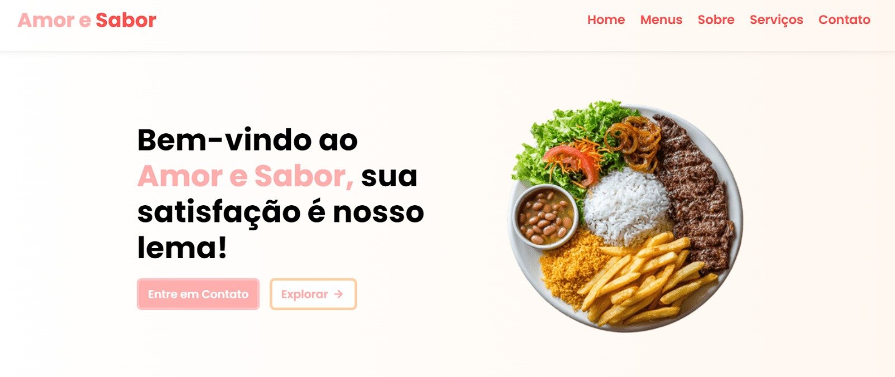

# Amor e Sabor - Site Institucional para Marmitaria

  

Projeto desenvolvido para uma marmitaria real, com foco em praticar JavaScript Vanilla, manipulação do DOM e integração com ferramentas externas (Instagram e Swiper). O site foi criado para ser uma vitrine digital simples, funcional e de fácil manutenção para o negócio.

## 📚 Sobre

O **Amor e Sabor** é um site institucional desenvolvido para uma marmitaria local, com o objetivo de apresentar o cardápio, os serviços e facilitar o contato com os clientes. O projeto foi construído com base em conceitos de:

- JavaScript Vanilla (ES6)
- Manipulação do DOM
- Eventos e animações com ScrollReveal
- Consumo de API para exibição de feed do Instagram
- Carrossel de imagens com Swiper.js

## 🚀 Tecnologias utilizadas

- **HTML5**: Estrutura semântica e acessível
- **CSS3**: Estilização responsiva com flexbox e grid
- **JavaScript (ES6)**: Interatividade, animações e manipulação do DOM
- **ScrollReveal**: Animações suaves ao rolar a página
- **Swiper.js**: Carrossel de imagens automático
- **Elfsight/Fouita**: Widget para feed do Instagram
- **Vercel**: Deploy e hospedagem

## 🖥️ Funcionalidades

- **Menu hambúrguer**: Navegação responsiva para dispositivos móveis, com fechamento ao clicar fora do menu.
- **Cardápio semanal**: Exibição organizada dos pratos do dia, com pratos fixos e alternância por abas.
- **Seção de salgados**: Grade de produtos com preços e botão de pedido via WhatsApp.
- **Carrossel automático**: Galeria de imagens com rolagem automática (Swiper.js), destacando fotos de eventos e produtos.
- **Feed do Instagram**: Integração com o Instagram para exibição dos posts mais recentes, incentivando o cliente a acompanhar as novidades.
- **Formulário de contato**: Envio de mensagens via Formspree (e-mail).
- **ScrollReveal**: Animações sutis que dão fluidez à navegação.
- **Responsividade**: Layout adaptado para todos os dispositivos (desktop, tablet e mobile).
- **Botões de pedido via WhatsApp**: Facilita a conversão do cliente em pedido real.

## 🎨 Design e identidade visual

- Paleta de cores personalizada, com tons de vermelho, dourado e bege, transmitindo aconchego e identidade de marca.
- Tipografia moderna e legível, com fontes do Google Fonts.

## 🔧 Como testar o projeto

Você pode acessar o site no ar através do link abaixo:

🔗 **[Acessar Amor e Sabor](https://amoresabor.vercel.app/)**

Ou, se preferir rodar localmente:

```bash
git clone https://github.com/seu-usuario/amor-e-sabor.git
cd amor-e-sabor
# Abra o arquivo index.html no navegador
